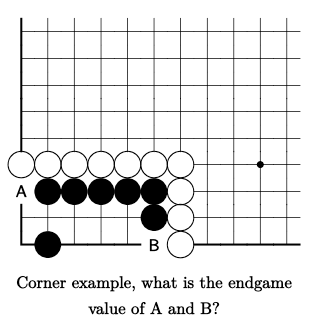
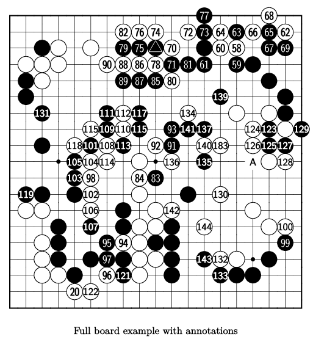

# SGF to PDF
Turn a directory of SGF go positions into one typeset PDF page per position,
using the [gnos](https://github.com/otrego/go-type1) Type1 go fonts for LaTeX.

```
sgf/*.sgf  ->  gnos/*.gnos  ->  pages/*.tex  ->  pdf/*.pdf
```

For example:

```
(;GM[1]FF[4]CA[UTF-8]SZ[19]
AB[bq][cq][dq][eq][fq][fr][bs]
AW[ap][bp][cp][dp][ep][fp][gp][gq][gr][gs]
LB[aq:A][fs:B]
C[VSZ[11:9\] CPT[Corner example, what is the endgame value of A and B?\]Digitized from page_018_fig_0 (auto-generated; verify before use)])
```



<details>
  <summary>Big board SGF - Click to expand</summary>

  ```
  (;GM[1]FF[4]CA[UTF-8]SZ[19]
  AB[ma][mb][ob][qb][cc][hc][ic][jc][mc][qc][rc][kd][ld][md][od][pd][be][he][ie][je][qe][bf][nf][rf][cg][gg][ig][rg][gh][ih][kh][lh][mh][qh][sh][ci][fi][hi][ki][qi][ri][ej][mj][ek][jk][bl][cl][el][ll][hm][dn][fn][hn][kn][do][go][jo][ko][ro][dp][fp][gp][hp][kp][mp][qp][eq][hq][kq][nq][oq][pq]
  AW[qa][hb][ib][jb][lb][nb][pb][rb][dc][fc][kc][nc][oc][bd][cd][dd][gd][hd][id][jd][ce][ke][hg][lg][og][qg][fh][hh][ph][rh][ei][gi][ji][mi][ni][pi][fj][gj][ij][kj][qj][rj][fk][ik][fl][il][nl][bm][cm][fm][jm][km][pm][in][jn][mn][qn][rn][co][ho][io][cp][ip][jp][np][op][cq][dq][gq][iq][er][fr]
  LB[ma:77][qa:68][hb:82][ib:76][jb:74][lb:72][mb:73][nb:64][ob:63][pb:66][qb:65][rb:62][hc:79][ic:75][kc:70][nc:60][oc:58][qc:67][rc:69][gd:90][hd:88][id:86][jd:78][kd:71][ld:81][md:61][od:59][he:89][ie:87][je:85][ke:80][nf:139][cg:131][gg:111][hg:112][ig:117][lg:134][fh:115][gh:109][hh:110][ih:115][kh:93][lh:141][mh:137][ph:124][qh:123][sh:129][ei:118][fi:101][gi:108][hi:113][ji:92][ki:91][mi:140][ni:183][pi:126][qi:125][ri:127][ej:105][fj:104][gj:114][kj:136][mj:135][pj:A][rj:128][ek:103][fk:98][ik:84][jk:83][bl:119][fl:102][nl:130][fm:106][km:142][fn:107][mn:144][rn:100][go:95][ho:94][ro:99][gp:97][mp:143][np:132][gq:96][hq:121][nq:133][er:20][fr:122]
  TR[jc]
  C[VSZ[19:19\]CPT[Full board example with annotations\]Digitized from page_016_fig_0 (auto-generated; verify before use)])
  ```

</details>



Each stage keeps the file's basename, so `sgf/diagram.sgf` becomes
`gnos/diagram.gnos`, `pages/diagram.tex` and finally
`pdf/diagram.pdf`.

Alongside the one-page PDFs, `all.pdf` is built at the project root: a single
document holding every page, in filename order. It is generated from the
`.gnos` files with the same template as the individual pages, one pdflatex
run, no external PDF-merging tool, so its pages are identical to them.

## Requirements

- Python 3.8+ (standard library only)
- GNU Make 4+ (macOS: `brew install make`, then use `gmake`)
- A TeX distribution with `pdflatex` (TeX Live, MacTeX, ...)
- The **gnos** fonts installed in your TEXMF tree:

  ```sh
  git clone https://github.com/otrego/go-type1
  go-type1/installer.sh install gnos
  ```

  The installer registers `gnos.map` with `updmap`, which pdflatex needs in
  order to embed the Type1 fonts — copying the font files somewhere and
  pointing `TEXINPUTS` at them is not enough, so the fonts are not vendored
  here. `make check` verifies the installation.

## Usage

```sh
make            # one PDF per diagram, plus the combined all.pdf
make -j8        # ... in parallel
make pdfs       # just the one-page PDFs
make combined   # just all.pdf
make clean
```

Directories, the combined document's name and the typesetting settings are
overridable:

```sh
make SGFDIR=/path/to/sgf GNOSDIR=build/gnos PAGESDIR=build/tex \
     PDFDIR=build/pdf ALLPDF=all.pdf SIZE=12 NOTES=1
```

`NOTES=1` shows the SGF comments (without the `VSZ[...\]` and `CPT[...\]` sub-fields) in the caption.
`SIZE=...` sets the size of the diagrams.

Changing `SIZE` or `NOTES` retypesets on the next `make`; no `make clean`
needed.

The scripts also run standalone, either over a directory or a single file:

```sh
python3 sgf2gnos.py --indir sgf --outdir gnos
python3 sgf2gnos.py sgf/one.sgf -o gnos/one.gnos

python3 gnos2tex.py --indir gnos --outdir pages
python3 gnos2tex.py gnos/one.gnos -o pages/one.tex
python3 gnos2tex.py --all all.tex gnos/*.gnos
python3 gnos2tex.py --notes --indir gnos --outdir pages
```

## Input: SGF with extended attributes

Ordinary SGF is understood — `SZ`, `AB`, `AW`, `LB`, and the `CR`/`TR`/`SQ`/`MA`
marks. Two extra attributes are read out of the standard comment property
`C[...]`:

| Attribute | Meaning | Default |
|---|---|---|
| `VSZ[V:H]` | Viewport: show only `V` columns by `H` rows, anchored at the **bottom-left** corner of the board. | the whole board |
| `CPT[text]` | Caption printed under the diagram. | empty |

Whatever else the comment says becomes the diagram's *note* — a provenance
line, say. Every `.gnos` file records it, but it is printed only when asked
for:

```sh
make NOTES=1     # print each note under its caption, in small italics
```

Switching `NOTES` retypesets the pages without regenerating the `.gnos`
diagrams. A comment can carry all three at once:

```
(;GM[1]FF[4]CA[UTF-8]SZ[19]
AB[ap][bp][cp][dp][ep][eq][br][cr][er][bs][cs][es]
AW[bn][dn][en][ao][bo][co][fo][gp][aq][bq][cq][dq][gq][ar][dr][gr][as][ds][fs]
LB[ao:4][co:6][br:3][cr:5][as:8][bs:1][cs:7][fs:2]
C[VSZ[11:9\] CPT[Black to play\] Comment])
```

Note the `\]`: per SGF, a `]` inside a property value is backslash-escaped, which
is what lets an attribute's brackets nest inside `C[...]` without closing it.

A cropped viewport keeps the real border glyphs on the edges it still touches
(here the left column and the bottom row, corner included); the sides it cuts
through render as ordinary interior lines, so the diagram reads as a piece of a
larger board rather than a tiny complete one.

### How labels are rendered

`LB` values are mapped to the best glyph gnos offers:

| Label | Rendering |
|---|---|
| `1`–`399` on a stone | the font's numbered-stone glyph (`\gnosb`/`\gnosbi`/`\gnosbii`/`\gnosbiii`, and the `\gnosw` equivalents) |
| `a`–`z` on a stone | the font's italic lettered-stone glyph (`\gnosbl` / `\gnoswl`) |
| anything else on a stone | the text overlaid on a plain stone (`\gnosblbl` / `\gnoswlbl`) |
| any label on an empty point | `\gnosptlbl` |

The overlay case covers uppercase letters, multi-character labels and numbers
above 399 — gnos has no glyphs for those, and overlaying keeps the label
exactly as the SGF wrote it rather than silently changing its case. Overlaid text is
sized from the board, not from the document font, so it tracks `SIZE` and
shrinks to fit inside an intersection; `\gnoslabelratio` (default `0.62`) sets
how large it is relative to the board.

## Output: `.gnos` files

A generated `.gnos` file is self-describing — it records its own width and
caption, so a document can place it without repeating either:

```latex
\gnoscols{11}%
\gnoscaption{Black to play}%
\gnosnote{Digitized from page\_023\_fig\_0}%
{\gnos%
\line{{\char91}++++++++++}
...
}%
```

## Using the diagrams in your own document

`sgf2pdf.sty` is usable on its own, independently of the page pipeline:

```latex
\usepackage[size=16]{sgf2pdf}        % add 'notes' to print \gnosnote too
...
\gobandiagram{gnos/corner.gnos}                  % centered, auto-sized
\gobandiagram[Diagram 4]{gnos/full_board.gnos}   % caption override
\gobanwrap{r}{gnos/other.gnos}                   % text wraps around it
Black \bstone{9} answers white \wstone{6}.       % inline stones
```

Both diagram macros size their box from the file's own `\gnoscols`, and fall
back to the file's own `\gnoscaption` when no override is given.

The `notes` option prints each diagram's `\gnosnote` under its caption, in
small italics. The `size=` option is the board font size in points. Be aware that gnos's
`\gnosfontsize` snaps to 8, 9, 10, 11, 12, 14, 16 or 20, and clamps anything
above 16 to 20 — there is no smooth scaling, so `size=15` silently gives 16.
